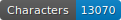
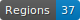
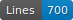
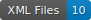

# HTR data for the SETAF project

   

## Data

ALTO files with segmentation and transcription fully corrected manually.

## Licence

Transcriptions are open source, not the images which belong to the library.

## Citation

Simon Gabay, _Data for gothic 16th c. French print_, university of Geneva, 2023.
